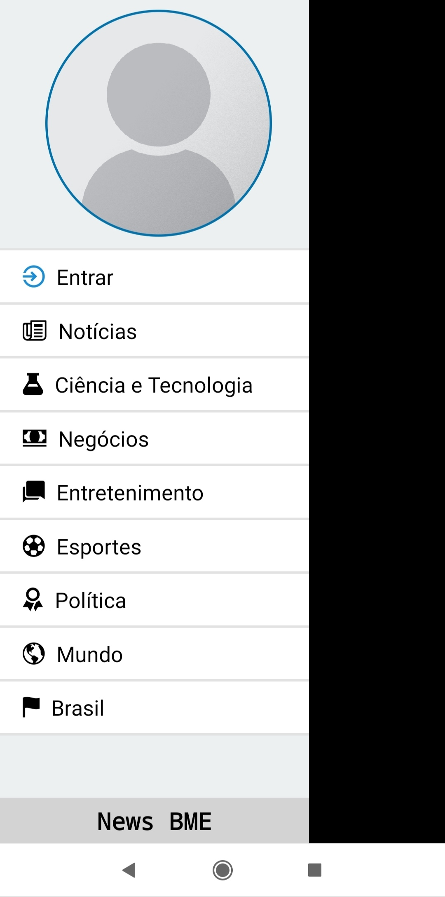
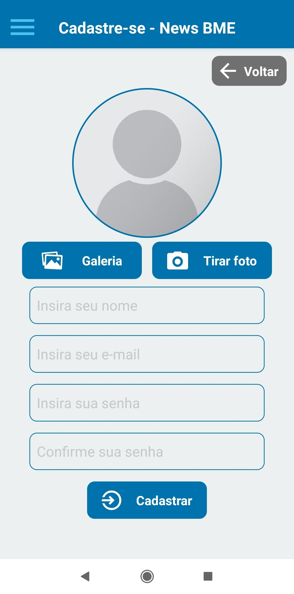

# News BME
>Aplicativo de notícias desenvolvido para a disciplina de Programação de dispositivos móveis, ministrada pelo professor Gerson Neto

## Instalação e Configuração

### Guia de configuração do ambiente React Native
- Para preparar o ambiente para desenvolver no React Native, começe por [aqui](https://react-native.rocketseat.dev/ "Guia de configuração do ambiente React Native").
- Para testar no smartphone, instale o [Expo](https://docs.expo.io/ "Expo").
- Documentação do [React Native](https://reactnative.dev/docs/getting-started "React Native")

## Navegação

### Tela Inicial

### Menu Lateral

### Login

### Cadastro

